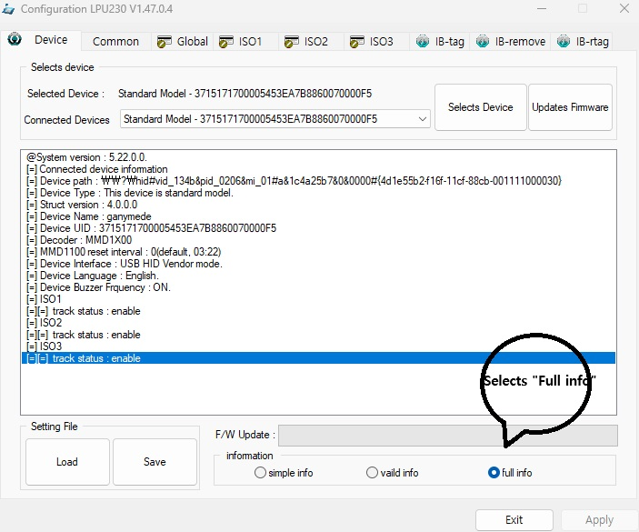
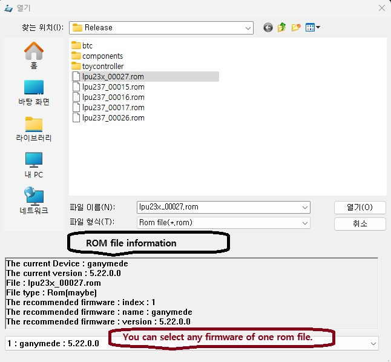

# public.lpu237.software
installer package of lpu23x' software.
[history](./doc/history_lpu23x.md)

# TIP!
* tg_lpu237_x.dll or OPOS 사용시, 이상하면, interface 를 USB HID Vendor 로 바꿔보세요.

# information
* date - 2024.04.16
* description
  * 정식 release
    - lpu237 himalia device 지원을 위해 mapper(lpu230.exe) v1.49.0.4 로 업데이트.
    - himalia device 지원을 위해 [mapper only 32 bits](./mapper_only/x86/lpu237_mapper_only_1_49_0.msi) 를  버전 1.49.0로 업데이트.
    - himalia device 지원을 위해 [mapper only 64 bits](./mapper_only/x64/lpu237_mapper_only_x64_1_49_0.msi) 를  버전 1.49.0로 업데이트.

* version - 각 버전은 같이 설치 불가. 다른 버전 설치시, 기존 버전 제거 후 , 설치. 같은 버전 끼리만 업데이트.(ex 현재 "full 32 bits" 설치되어 있는데 "full 64 bits" 설치하려면, 기존 것 제거 후, 설치.)
  * [full 32 bits](./full/x86/lp230_1_8_70.msi) 버전 1.8.70
    - 지원되는 기능
      - mapper를 통한 설정.
      - MSR & i-button [OPOS](http://monroecs.com/index.htm) service object(이하 SO).
      - native MSR application 지원을 위한 32bits win32 dll.
      - native i-button application 지원을 위한 32bits win32 dll.
      - native firmware application 지원을 위한 32bits win32 dll.
      - 사용자 application 은 MSR 과 i-button 을 독립된 장비로 프로그램 가능.
      - Windows service process( session 0, system account)에서 OPOS Common Control Objects(이하 CCO)를 사용할 경우, 제공되는 SO 사용 불가능.
      - Windows service process( session 0, system account)에서 MSR, i-button 또는 firmware application 지원을 위한 dll 사용 불가능.
    - 포함된 components
      - lpu230 SO v1.8.23(OposLpu230.dll)
      - lpu230 keylock SO v1.14.2(OposLpu230Lock.dll)
      - Mapper v1.48.0.4
      - Javapos SO v1.11
      - lpu237 api v4.2(tg_lpu237_dll.dll)
      - lpu237 i-button api v4.2(tg_lpu237_ibutton.dll)
      - lpu237 firmware api v4.2(tg_lpu237_fw.dll)
      - lpu237 tools api v4.2(tg_lpu237_tools.dll)
      - manager v1.6( ng_DevManager.exe )
      - controller v1.2.0.1( ng_ManagerCtl.exe )
      - service v1.1.0.1(ng_SSS.exe )
      - DDL v1.1 ( ng_DDL_lpu237.dll )
  * [full 64 bits](./full/x64/lpu230_x64_1_8_70.msi) 버전 1.8.70
    - 지원되는 기능
      - mapper를 통한 설정.
      - native MSR application 지원을 위한 64bits win32 dll.
      - native i-button application 지원을 위한 64bits win32 dll.
      - native firmware application 지원을 위한 64bits win32 dll.
      - 사용자 application 은 MSR 과 i-button 을 독립된 장비로 프로그램 가능.
      - Windows service process( session 0, system account)에서 MSR, i-button 또는 firmware application 지원을 위한 dll 사용 불가능.
    - 포함된 components
      - Mapper v1.48.0.4
      - lpu237 api v4.2(tg_lpu237_dll.dll)
      - lpu237 i-button api v4.2(tg_lpu237_ibutton.dll)
      - lpu237 firmware api v4.2(tg_lpu237_fw.dll)
      - lpu237 tools api v4.2(tg_lpu237_tools.dll)
      - manager v1.6( ng_DevManager.exe )
      - controller v1.2.0.1( ng_ManagerCtl.exe )
      - service v1.1.0.1(ng_SSS.exe )
      - DDL v1.1 ( ng_DDL_lpu237.dll )
  * [mapper only 32 bits](./mapper_only/x86/lpu237_mapper_only_1_49_0.msi) 버전 1.49.0.
    - 지원되는 기능
      - mapper를 통한 설정.
    - 포함된 component
      - Mapper v1.49.0.4
  * [mapper only 64 bits](./mapper_only/x64/lpu237_mapper_only_x64_1_49_0.msi) 버전 1.49.0.
    - 지원되는 기능
      - mapper를 통한 설정.
    - 포함된 component
      - Mapper v1.49.0.4
  * [msr only 32 bits](./msr_only/x86/lpu230_msr_only_1_8_70.msi) 버전 1.8.70
    - 주의 : MSR SO 는 독립적으로 장비에 접근하기 때문에, 프로그래밍 설계방식에 따라 tg_lpu237_tools.dll 사용시 동기화 문제 발생 소지가 있음..
    - 지원되는 기능
      - mapper를 통한 설정.
      - MSR [OPOS](http://monroecs.com/index.htm) SO.
      - native MSR application 지원을 위한 32bits win32 dll.
      - native firmware application 지원을 위한 32bits win32 dll.
      - 사용자 application 은 MSR 만 프로그램 가능.
      - Windows service process( session 0, system account)에서 OPOS CCO를 사용할 경우도, 제공되는 SO 사용 가능.(NCR Device Services API 에서 사용 가능.)
      - Windows service process( session 0, system account)에서 MSR application 지원을 위한 dll 사용 가능.
      - Windows service process( session 0, system account)에서 firmware application 지원을 위한 dll 사용 불가능.
    - 포함된 components
      - lpu230 SO v1.8.22
      - Mapper v1.48.0.4
      - Javapos SO v1.11
      - lpu237 api v4.2(tg_lpu237_dll.dll)
      - lpu237 i-button api v4.2(tg_lpu237_ibutton.dll)
      - lpu237 firmware api v4.2(tg_lpu237_fw.dll)
      - lpu237 tools api v4.2(tg_lpu237_tools.dll)
      - manager v1.6( ng_DevManager.exe )
      - controller v1.2.0.1( ng_ManagerCtl.exe )
      - service v1.1.0.1(ng_SSS.exe )
      - DDL v1.1 ( ng_DDL_lpu237.dll )
  * lpu230_update : 고객 특별 요청으로 2019.12.11 부터 배포. Mapper 설치 없이, rom 파일로, lpu237 firmware 를 업데이트하는 프로그램.
    - 지원되는 기능
      - lpu237 firmware 업데이트.
      - [더 자세한 내용은 여기](https://github.com/elpusk/public.lpu237.firmware)
    - 포함된 components
	    - lpu230_update.exe v1.4 : 프로그램 본체.( 2024.02.26 v1.4로 업데이트)
	    - ng_DDL_hid.dll :  lpu230_update.exe 에서 사용하는 라이브러리.
	    - tg_rom.dll  :  lpu230_update.exe 에서 사용하는 라이브러리.
	    - lpu230_update_UM_EN_005.pdf : 프로그램 사용 설명서 영문.
	    - lpu230_update_UM_KOR_005.pdf : 프로그램 사용 설명서 국문.
      - lpu230_update_v1.4.zip : 압축파일( lpu230_update.exe, ng_DDL_hid.dll,tg_rom.dll, lpu230_update_UM_EN_005.pdf 과 lpu230_update_UM_KOR_005.pdf )

  * 기타
    - 문서
      - 고객 요청에 따른 lpu230_api_tools_UM_KOR_V4.2.pdf 의 영문판 [lpu230_api_tools_UM_EN_V4.2.pdf](./doc/lpu230_api_tools_UM_KOR_V4.2.pdf).
        - lpu230_api_tools_UM_EN_V4.1.pdf 에서 lpu230_api_tools_UM_EN_V4.2.pdf 으로 업데이트됨.
      - 고객 요청에 따른 lpu230_fw_api_UM_EN_008.pdf 의 영문판 [lpu230_fw_api_UM_EN_008.pdf](./doc/lpu230_fw_api_UM_EN_008.pdf).
        - lpu230_fw_api_UM_EN_007.pdf 에서 lpu230_fw_api_UM_EN_008.pdf 으로 업데이트됨.

# etc
* mapper 1.46(이하 mapper) 을 가지고, lpu237 를 lpu238 로 변경 하기.(비권장)
  - 확장자가 rom 인 파일(이하 rom 파일)로 업데이트를 하면, 안정성을 위해 동일한 system name 과 update condition 이 만족 할 때만 업데이트를 허용 합니다.
  - lpu237 은 서로 다른 하드웨어를 기반으로한 callisto, ganymede 라는 두 개의 system name이 있고, lpu238 은 lpu237 의  ganymede 와 하드웨어는 동일 하지만, 전혀 다른 interface 를 가진 장비로 PC에서 인식하고, europa 라는 system name 를 갖습니다. 따라서 mapper 에서 rom 파일로  lpu237 를 lpu238 로 변경은 불가능 합니다. 이런 안전성을 무시하고, mapper에서 , lpu237 를 lpu238 로 변경하기 위해서는 아래와 같이.......
    - https://github.com/elpusk/public.lpu237.firmware 에서 lpu23x_00027.zip 를 다운받아서 
lpu238_1.1.bin 이라는 순수 lpu238 용 firmware binary 파일을 얻음.
    - mapper 실행.
    - "Selects Device" 선택(lpu238 변경하고자 하는 lpu237 선택) .
    - "Updates Firmware" 선택.
    - "파일 선택" 대화 상자에서 하단의 "파일 이름"에 "*" 라고 입력하고 엔터(모든 파일 보임).
    - "lpu238_1.1.bin" 파일 선택.
    - 업데이트 완료까지 기다림.

*  lpu238 를  lpu237 로 변경.(비권장)
   - 위 과정과 동일하며, lpu238_1.1.bin 대신 lpu237_5.22.bin 를 사용.
   - lpu237_5.22.bin 는  https://github.com/elpusk/public.lpu237.firmware 의 lpu23x_00027.zip 에서 얻음.

* mapper 1.47 이상에서 advance firmware update mode 로  lpu237 를 lpu238 로 변경 하기.(비권장)
   - mapper 를 실행 시키고 "Update Firmware" 버튼 실행 전에, "Full info"를 선택한다. 
   - "Update Firmware" 버튼 실행하면 advance firmware update mode를 위한 파일 선택 상자를 볼수 있음.
   - lpu23x_00027.rom 을 선택하고, 하단의 drop list 에서 europa 1.1.0.0 을 선택 후, 열기를 실행.
   - lpu23x_00027.rom 은 https://github.com/elpusk/public.lpu237.firmware 에서 lpu23x_00027.zip 를 다운받아서 압축해제하면 얻을 수 있음.

-----------

    